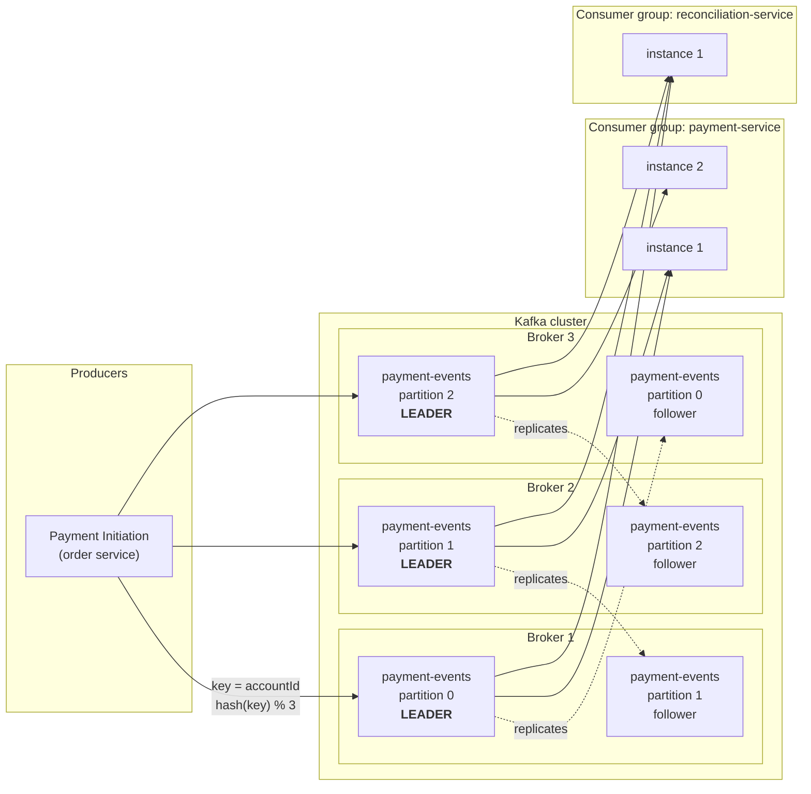
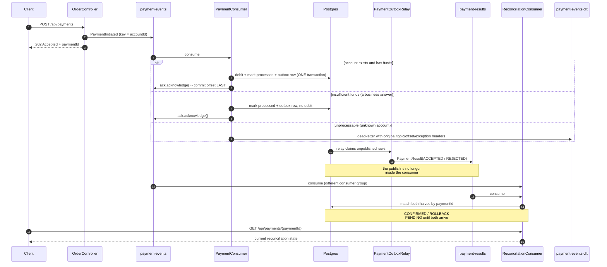

# kafka

An event-driven payment ledger built to rehearse Kafka interview questions (the kind Wise/Revolut-style interviews ask)
on one running story: a customer sends money, and three independent services react to it. Every section below is written
the way you'd actually say it out loud — the code is the easy part, being able to explain *why* each setting is there is
the interview.

Everything is verified by **Testcontainers integration tests** against a real Kafka broker and a real Postgres. There
is no unit-test layer at all: the things worth proving here (ordering, redelivery, dead-lettering) only exist when a
real broker is involved.

---

## Kafka in one diagram



**Reading it out loud:** a producer writes to a **topic**, which is split into **partitions** spread across **brokers**.
The **key** (here `accountId`) decides the partition, so all events for one account are on one partition and therefore
strictly ordered. Each partition has one **leader** handling reads and writes, and **follower** replicas on other
brokers; if the leader's broker dies, a follower is promoted and nothing is lost. Consumers in the **same group split
the partitions** (that's how you scale out — and why no two instances of the payment service ever process the same
payment). Consumers in **different groups each get the whole stream** (that's how you fan out — reconciliation reads
every event without the payment service knowing it exists).

## What this app actually does



## Quickstart

```powershell
cd Learning-Bank
.\mvnw.cmd -pl kafka verify
```

`verify` is the real gate — it starts its own Kafka and Postgres via Testcontainers, so it does not need the compose
stack. Use compose only when you want to drive the app by hand:

```powershell
docker compose -f docker/docker-compose.yml up -d
.\mvnw.cmd -pl kafka spring-boot:run
```

```powershell
curl -X POST localhost:8082/api/payments -H "Content-Type: application/json" -d "{\"accountId\":1,\"amountMinor\":25000,\"description\":\"rent\"}"
curl localhost:8082/api/reconciliation
```

## The three roles

They live in one Spring Boot app as three packages — `order/`, `payment/`, `reconciliation/` — but they **only ever talk
through Kafka topics**. There is not a single direct method call across those package boundaries, which is what makes
"these are three services in production" an honest thing to say rather than a wish. Running them in one JVM keeps
`mvnw verify` able to test the whole flow end to end; splitting them into three deployables would be a packaging
change, not a redesign.

| Role | Produces | Consumes | Owns |
|---|---|---|---|
| `order/` | `payment-events` | — | nothing; it publishes and forgets |
| `payment/` | `payment-results` | `payment-events` | account balances, processed-event log |
| `reconciliation/` | — | **both** topics | the matched view of each payment |

## Concept → where it lives

| Kafka concept | Where, concretely |
|---|---|
| Producer / Consumer | `PaymentInitiationService` / `PaymentConsumer`, `ReconciliationConsumer` |
| Topic | `common/Topics.java`, created in `config/KafkaTopicConfig.java` |
| Partitions | `KafkaTopicConfig.PARTITIONS` — 3, with the sizing rationale in the javadoc |
| **Partition key** | `accountId` as the record key in `PaymentInitiationService` — proved by `Phase4OrderingIT` |
| Offsets & commit timing | `ack-mode: manual_immediate` in `application.yml`; `ack.acknowledge()` is the **last** line of `PaymentConsumer.consume` |
| Consumer groups | `payment-service` vs `reconciliation-service` — same topic, independent offsets |
| Idempotent consumer | `ProcessedEvent` + its primary key — proved by `Phase2IdempotencyIT` |
| Transactional outbox | `PaymentOutbox` written inside `process()`'s transaction; `PaymentOutboxRelay` publishes — proved by `Phase5OutboxIT` |
| Idempotent **producer** | `enable.idempotence: true` + `acks: all` in `application.yml` |
| Retries & DLQ | `@RetryableTopic` + `@DltHandler` on `PaymentConsumer` — proved by `Phase3RetriesDltIT` |
| Replication & failover | 1 replica in dev; see below for why production is different |

## Phase 1 — Topics, partitions & keys (`phase1_topics_partitions/`)

The ground floor: a record is appended to a **topic**, which is split into **partitions**, and the record's **key**
decides which one it lands on. `hash(key) % partitionCount` is the whole mechanism — there is nothing else enforcing
per-account ordering later on, which is why this phase comes first.

`Phase1TopicsPartitionsIT` drives the full happy path end to end (HTTP → `payment-events` → debit → `payment-results` →
reconciliation CONFIRMED) without calling a single service method directly, then asserts that three payments for one
`accountId` all resolve to the same partition. Note the API answers **202, not 201**: at that instant nothing has been
debited, and all that has happened is a durable append to a topic.

## Phase 2 — Offsets & the idempotent consumer (`phase2_idempotency/`)

**Commit the offset last, never first.** With Spring's default ack mode, offsets are committed on a schedule after the
listener returns. Crash between reading a record and finishing the ledger write, and Kafka already believes that payment
was handled — the message is gone and the money never moved. Setting `ack-mode: manual_immediate` and calling
`ack.acknowledge()` only after the database transaction has committed turns "we might lose a payment" into "we might
process one twice", which is a problem you can actually solve.

**Which is why the consumer has to be idempotent.** Kafka's default guarantee is **at-least-once**. Committing the
offset after the work means a crash in that window redelivers a message the app already applied. `ProcessedEvent` is a
table with the `eventId` as its primary key: before applying anything the consumer checks whether it has seen that id,
and inserts the row in the *same transaction* as the debit. The read is only an optimization — two concurrent deliveries
can both pass it — but only one can commit the insert, and the loser's transaction rolls its debit back with it. **The
constraint is the guarantee; the check is the optimization.**

Note this is a *different* problem from `enable.idempotence: true` on the producer, which people often conflate. That
setting stops a *producer* retry from writing the same record twice. It says nothing about a *consumer* reading a record
twice. You need both, and they solve different halves.

## Phase 3 — Retries & the dead-letter topic (`phase3_retries_dlt/`)

**Rejected is not failed.** Insufficient funds is a correct, final business answer: it gets a REJECTED result event,
commits its offset, and never retries — retrying would just decline it again forever. An unknown account is genuinely
unprocessable, so it dead-letters. Getting this distinction wrong is how you end up with a DLT full of perfectly
ordinary declines that nobody can triage.

**Retries are non-blocking.** The naive retry is to sleep and loop inside the listener, but the consumer holds its
partition while it does that — so one bad record stalls every healthy record behind it, and a long enough stall trips
`max.poll.interval.ms` and gets the consumer evicted from the group. `@RetryableTopic` republishes the failed record to
a separate retry topic and moves on immediately; the waiting happens over there.

**Never drop a dead letter.** A dead-lettered record is a payment a customer believes they made. It keeps the original
topic, offset, and exception as headers, so it can be triaged and replayed once the bug is fixed.

## Phase 4 — Ordering, and my own retry topic breaking it (`phase4_ordering/`)

`Phase4OrderingIT.InProducedOrderTests` establishes the guarantee: two events sharing an `accountId` share a partition,
so one consumer thread applies them in offset order. The amounts are chosen so the order changes the answer — the
account holds exactly enough for the first payment and not the second, because balances are additive and "debit 10 then
debit 20" would end at the same number either way.

Then the second block withdraws it, and noticing the tension is worth more than a design with no tension in it.

This module promises per-account ordering *and* non-blocking retries via `@RetryableTopic` (phase 3). But when event #2
for an account fails, Spring republishes it to `payment-events-retry-300` and moves on — so #3 and #4 keep flowing on
the main topic and are applied **first**. Per-account ordering is gone precisely in the failure case where it mattered.
`UnderRetryTests` proves it: three payments, the second fails transiently, and the third takes the money the second was
queued for.

**There is no free fix — you pick:**

- **Accept it**, and make the downstream commutative or idempotent. Fine for a debit keyed on an event id; not fine for
  a state machine where "cancelled then shipped" and "shipped then cancelled" differ.
- **Block and retry in place**, accepting head-of-line blocking, within a `max.poll.interval.ms` budget — the thing
  `@RetryableTopic` exists to avoid, so this is a deliberate trade back.
- **`Consumer.pause()` the partition** and retry with backoff. Keeps order at the cost of throughput *for that partition
  only*, which is the middle ground.

Two details the test surfaced that are worth carrying:

- **"Non-blocking" retries still block briefly.** When the listener throws, Spring publishes the record to the retry
  topic *on the consumer thread* — about 450ms here. The first version of the test failed because the retried event beat
  the following one by 9ms; the two were the same order of magnitude. It now fails twice so the retry lands on the 600ms
  tier and the margin is a full second.
- **Assert on a terminal state, never on ordering you observed.** Balances are additive, so the final number is
  identical either way. Funding the account for exactly one of two equal payments makes "which one was ACCEPTED" a
  terminal fact that only one ordering can produce.

## Phase 5 — The dual-write problem, and the transactional outbox (`phase5_outbox/`)

**This started as a bug in this repo, and the bug is the better story.** `PaymentConsumer` used to commit the database
transaction and then hand the result to `kafkaTemplate.send(...)` — which is **asynchronous**. It returns a future the
moment the record lands in the producer's accumulator, not when the broker has it. The code discarded that future and
acknowledged the offset on the very next line. If the broker rejected the send, the offset was already committed and the
result was gone: no redelivery, no DLT, nothing to replay. That quietly contradicted this module's own headline claim,
*commit the offset last*.

**The obvious fix doesn't work, and that's the interesting part.** Block on the send before acknowledging:

```java
kafkaTemplate.send(Topics.PAYMENT_RESULTS, key, result).get(5, SECONDS);
ack.acknowledge();
```

This narrows the window without closing it. If the send times out the listener throws, `@RetryableTopic` redelivers, and
`PaymentProcessingService.process` hits its own idempotency check, sees the `processed_events` row and returns early.
The debit is correctly not re-applied — and the result is now **permanently** unpublishable, because the only thing that
could have produced it was the run that already happened. The retry actively makes it worse.

**The fix that works.** The result is written into a `payment_outbox` row inside the same transaction as the debit and
the `processed_events` marker. Three writes, one commit, nothing asynchronous left between the commit and the ack — so
the `KafkaTemplate` is gone from `PaymentConsumer` entirely. Note *how* this resolves the retry trap: not by returning
the previously computed result on a duplicate, but by never needing to. The early return is safe precisely because the
first attempt's outbox row is still there.

The outbox row is keyed on `source_event_id`, the id of the `PaymentInitiated` event that produced it, so at most one
row can ever exist per consumed event. Same framing as `processed_events` — the constraint is the guarantee.

**Two relays, and which one is load-bearing.** A `@Scheduled` sweep claims unpublished rows with `ORDER BY id ... FOR
UPDATE SKIP LOCKED`; a `@TransactionalEventListener(AFTER_COMMIT)` publishes the row immediately so the happy path
doesn't wait out a poll interval. **The poller is the guarantee, the listener is the optimization.** Delete the listener
and the system is slower but still correct; delete the poller and it is fast right up until the first crash. The
listener therefore catches and logs everything — Spring propagates after-commit exceptions back to the caller, so
letting one out would fail a consumer whose database work had already committed, and dead-letter a payment that actually
succeeded.

**Two traps worth naming, both of which bit during implementation.**

- The relay is split into `PaymentOutboxRelay` (scheduling) and `PaymentOutboxRelayOps` (`@Transactional`). A
  `@Scheduled` method calling an annotated method on `this` bypasses the proxy: no transaction opens, the entities come
  back detached, and the flip to `published` is never flushed. The relay would log "publishing…" forever and mark
  nothing — and a test calling the method directly would pass, because it goes *through* the proxy.
- `relayOnce()` is `REQUIRES_NEW`, not the default `REQUIRED`. The after-commit listener runs while the publishing
  transaction is still completing, so `REQUIRED` joins a transaction that can no longer be used and the claim query
  fails with *"Query requires transaction be in progress"*. Notice how that hid: the poller retried 500ms later and
  succeeded, so the system stayed correct and only a log warning said otherwise. **Belt-and-braces designs mask the
  failure of one of their braces.**

**The honest caveat.** This relay is at-least-once. If the process dies between a successful send and the commit that
flips `published`, the record is published twice. That's safe here because `ReconciliationService` upserts on
`paymentId` — but the general point is the one to say out loud: **an outbox does not remove the need for idempotency, it
moves it downstream.** The alternative, flipping the row before sending, trades duplicates for lost messages, which for
money movement is the worse of the two.

**The road not taken.** `processed_events` and `payment_outbox` could be one table — the marker row gaining a payload
and a `published` flag. Fewer moving parts, one less insert per payment. Two tables wins on separation of concerns
(idempotency and delivery are different jobs with different retention needs) and on symmetry with the postgres module's
own `outbox`. It's a real trade, not an obvious call.

## Phase 6 — Rebalancing (`phase6_rebalancing/`)

`Phase6RebalancingIT` stops the listener container, raises its concurrency and restarts it — a genuine leave-and-rejoin,
not a simulation — while events are in flight, and asserts every account is debited exactly once. **What saves you is
`processed_events`**, because a rebalance can absolutely redeliver a record whose offset had not yet been committed.
Rebalancing is not an exactly-once mechanism; idempotency is what makes it survivable.

**Three timeouts, three different failures** — worth having cold:

| Setting | What it measures | What it means when it fires |
|---|---|---|
| `heartbeat.interval.ms` | liveness, from a background thread | nothing on its own — it feeds the next one |
| `session.timeout.ms` | how long the coordinator waits for heartbeats | the process is presumed dead |
| `max.poll.interval.ms` | how long your *processing* takes between polls | a healthy but slow consumer is evicted |

That third one is why `@RetryableTopic` exists rather than sleeping in the listener: a long enough sleep gets you kicked
out of the group mid-payment.

**Eager vs cooperative.** The classic protocol is stop-the-world — every member revokes every partition, then the group
reassigns, and nobody works in between, so a rolling deploy of N pods costs N full pauses. `CooperativeStickyAssignor`
(set in `application.yml`) revokes only the partitions that actually move. The operational answer is the upgrade
path: you **cannot** flip a live group in one deploy, you roll out `[CooperativeSticky, Range]` first so every member
speaks both, then drop `Range` in a second rollout.

**Static membership (`group.instance.id`) is deliberately *not* configured**, and the comment in `application.yml` says
why. It lets a restarting pod keep its partitions instead of triggering a rebalance — right in production, wrong here,
because a member that really has gone away holds its partitions until `session.timeout.ms` elapses, and this suite
starts and stops contexts constantly.

**KIP-848**, for 2026 credibility: the next-generation protocol moves assignment off the clients into the broker-side
coordinator, so rebalances become incremental and stop being stop-the-world. GA in Kafka **4.0** — brokers support it
out of the box, but `classic` is still the *client* default, so a consumer opts in with `group.protocol=consumer`. This
module is pinned to `apache/kafka:3.9.1`, so that stays a talking point rather than a demo.

## Trade-offs worth being able to defend

- **Strong consistency for balances, eventual for reconciliation.** The debit takes a `SELECT ... FOR UPDATE` row lock
  and commits transactionally. The reconciliation view is derived bookkeeping that catches up a few milliseconds later,
  so it gets no retry topic and no dead-letter path — if it lags, no money is wrong. Picking different guarantees for
  different consumers of the same stream is the point, not an inconsistency.
- **At-least-once + idempotent consumers, not exactly-once.** Kafka's exactly-once semantics are real but they only
  cover Kafka-to-Kafka flows. The moment you write to Postgres, an external API, or send an email, you're outside that
  boundary. Idempotent consumers work everywhere and are far easier to reason about.
- **Ordering vs. even load.** Keying by `accountId` gives per-account ordering, but a very hot account concentrates load
  on one partition and one slow record blocks everything behind it. These two goals are in direct tension and you have
  to pick per topic.
- **Plain consumers instead of Kafka Streams for reconciliation.** A Streams KStream-KTable join would be the idiomatic
  answer at scale, and would handle windowing and state stores for you. This uses two plain `@KafkaListener`s and a
  Postgres row instead, because the *matching logic* is what an interviewer probes, and a topology with changelog topics
  and state stores is a lot of extra surface to defend. Worth knowing the Streams version exists and why you'd reach for
  it.
- **1 replica here, 3 in production.** A single-broker dev cluster can't do better. In production you'd run `replicas=3`
  with `min.insync.replicas=2`, which only means something *combined with* the producer's `acks=all`: `acks=all` with
  `min.insync.replicas=1` still acknowledges when only the leader has the data. That's the durability gap people miss.

## The tests

One IT per phase, with a `@Nested` block per scenario — the same layout as the concurrency and postgres modules. The
blocks are where the pairings live: phase 3 asserts a record is *absent* from the DLT and then that one is *present*,
and phase 4 establishes the ordering guarantee and then breaks it. A single block can be run on its own with
``-Dit.test='Phase5OutboxIT$CrashWindowRecoveryTests'``.

| Test | Proves |
|---|---|
| `Phase1TopicsPartitionsIT` | The full path: HTTP → topic → debit → result topic → CONFIRMED. Plus that one `accountId` always resolves to one partition |
| `Phase2IdempotencyIT` | The same `eventId` delivered twice debits once — and *stays* once. Distinct ids both apply |
| `Phase3RetriesDltIT` | `RejectedNotFailedTests`: a decline is a business answer — REJECTED result, ROLLBACK reconciliation, balance untouched, **nothing dead-lettered**. `DeadLetterTests`: an unprocessable event reaches the DLT carrying its original topic and failure reason as headers |
| `Phase4OrderingIT` | `InProducedOrderTests`: two events for one account apply in produced order, using amounts where the order changes the final balance. `UnderRetryTests`: this module's own retry topic breaks that guarantee — a limitation, proved rather than hidden |
| `Phase5OutboxIT` | `AtomicityTests`: the result row is written in the *same* transaction as the debit, so a successful payment leaves exactly one row and a failed one leaves none. `RelayTests`: the relay drains what it finds. `CrashWindowRecoveryTests`: a result lost before its send lands is recovered, and the redelivery that follows does not debit twice — counted rather than waited for, so the result must appear **twice**, which no timing can fake |
| `Phase6RebalancingIT` | No record is lost or double-applied across a real leave-and-rejoin rebalance; the idempotency table is what saves you |

```powershell
.\mvnw.cmd -pl kafka verify
.\mvnw.cmd -pl kafka verify -Dit.test=Phase2IdempotencyIT
```

## Project layout

```
src/main/java/com/kafkabank/
  common/          event records (PaymentInitiated, PaymentResult, PaymentResultRecorded), enums, Topics constants
  config/          KafkaTopicConfig — partition/replica counts and the reasoning
  order/           OrderController + PaymentInitiationService  (produces payment-events)
  payment/         PaymentConsumer + PaymentProcessingService  (consumes it, owns balances)
                   PaymentOutboxRelay + ...RelayOps  (the outbox's two relays)
                   AccountController  (read balances by hand while driving the app)
                   SimulatedTransientFailure  (fault injection for phase 4's retry block)
  reconciliation/  ReconciliationConsumer + ReconciliationService (consumes BOTH topics)
src/main/resources/
  application.yml  every Kafka setting, commented with why it's set that way
  schema.sql
src/test/java/com/kafkabank/
  TestContainerConfig.java             singleton Kafka (KRaft) + Postgres
  BaseKafkaIT.java                     shared HTTP + topic-draining helpers
  phase1_topics_partitions/Phase1TopicsPartitionsIT.java   happy path + partition key
  phase2_idempotency/Phase2IdempotencyIT.java              at-least-once, applied once
  phase3_retries_dlt/Phase3RetriesDltIT.java               @Nested: RejectedNotFailed, DeadLetter
  phase4_ordering/Phase4OrderingIT.java                    @Nested: InProducedOrder, UnderRetry
  phase5_outbox/Phase5OutboxIT.java                        @Nested: Atomicity, Relay, CrashWindowRecovery
  phase6_rebalancing/Phase6RebalancingIT.java              leave-and-rejoin, nothing lost
```

**Main sources stay split by role, not by phase** — for the reason given under *The three roles* above. Every phase
cuts across exactly one of the three, so folding main into phase packages would create the first cross-role dependency
and buy nothing. The phases are how the *tests* are read, and reading is what they are for.

---

## Questions this module answers

| Question | Where |
|---|---|
| How do you guarantee a payment is processed exactly once? | phase 2 — you don't; you make it idempotent. `Phase2IdempotencyIT` |
| Where exactly do you commit the offset, and why there? | `ack-mode: manual_immediate`; `PaymentConsumer` |
| Consumer idempotence vs producer idempotence — different things? | phase 2, closing paragraph |
| Your DB commit and your Kafka publish aren't atomic. What now? | the outbox section; `Phase5OutboxIT` |
| The process dies between the commit and the publish. | `Phase5OutboxIT.CrashWindowRecoveryTests` |
| How do you keep events for one account in order? | partition key; `Phase4OrderingIT` |
| ...and what breaks that guarantee? | `Phase4OrderingIT.UnderRetryTests` |
| One account is 50% of your traffic. | trade-offs; hot-partition discussion |
| What happens during a rebalance? Name the three timeouts. | the rebalancing section; `Phase6RebalancingIT` |
| Eager vs cooperative rebalancing, and how do you migrate? | the rebalancing section |
| Retry without blocking the partition. | `@RetryableTopic`; `Phase3RetriesDltIT.DeadLetterTests` |
| A business decline isn't a failure — how do you model that? | "rejected is not failed"; `Phase3RetriesDltIT.RejectedNotFailedTests` |
| `acks=all` — is that enough for durability? | `KafkaTopicConfig`, `min.insync.replicas` |
| Why is `max.in.flight=5` safe here? | `application.yml` producer block |
| How many partitions, and can you change it later? | `KafkaTopicConfig` javadoc |
