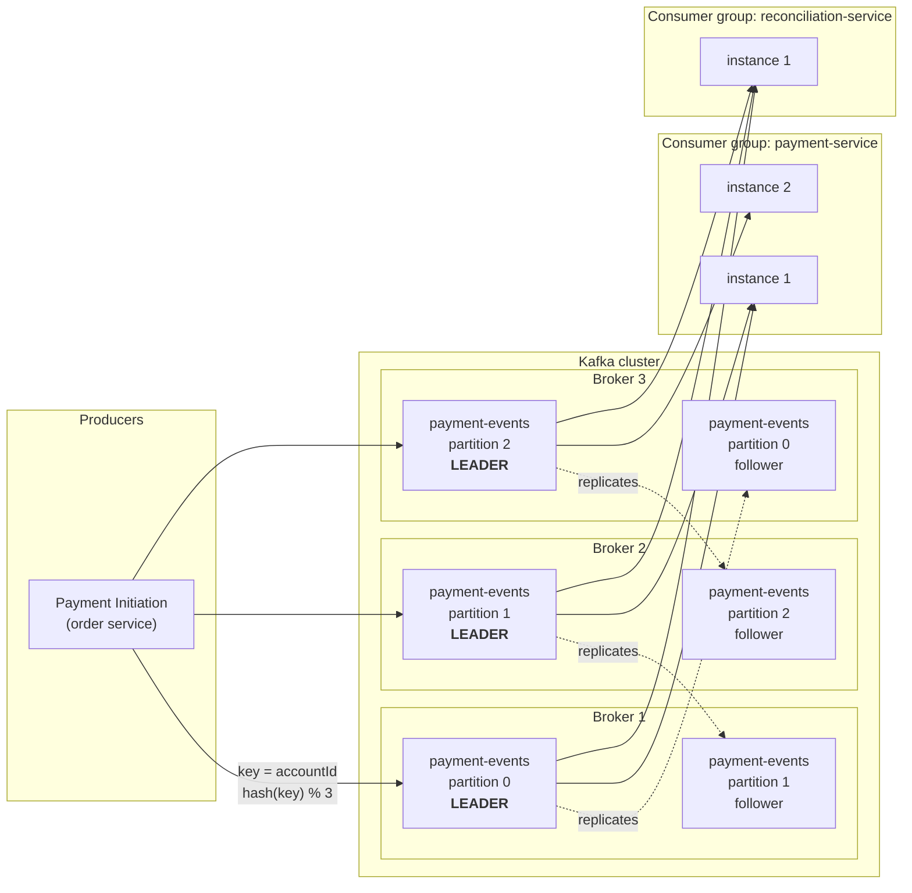
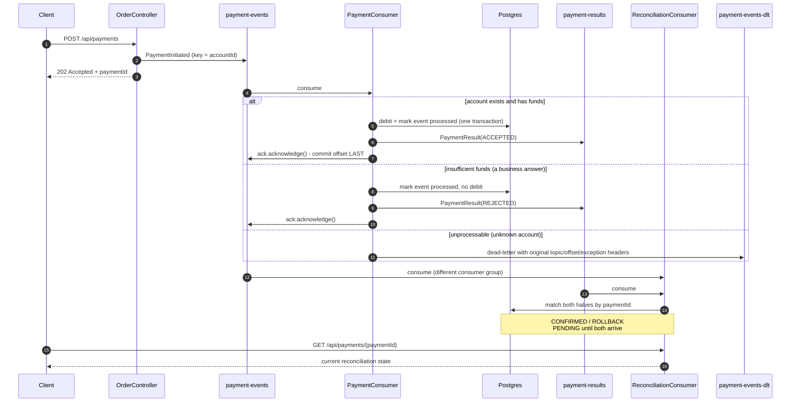

# kafka

An event-driven payment ledger built to rehearse Kafka interview questions (the
kind Wise/Revolut-style interviews ask) on one running story: a customer sends
money, and three independent services react to it. Every section below is
written the way you'd actually say it out loud — the code is the easy part,
being able to explain *why* each setting is there is the interview.

Everything is verified by **Testcontainers integration tests** against a real
Kafka broker and a real Postgres. There are no unit tests and no mocks: the
things worth proving here (ordering, redelivery, dead-lettering) only exist when
a real broker is involved.

---

## Kafka in one diagram



**Reading it out loud:** a producer writes to a **topic**, which is split into
**partitions** spread across **brokers**. The **key** (here `accountId`) decides
the partition, so all events for one account are on one partition and therefore
strictly ordered. Each partition has one **leader** handling reads and writes,
and **follower** replicas on other brokers; if the leader's broker dies, a
follower is promoted and nothing is lost. Consumers in the **same group split
the partitions** (that's how you scale out — and why no two instances of the
payment service ever process the same payment). Consumers in **different groups
each get the whole stream** (that's how you fan out — reconciliation reads every
event without the payment service knowing it exists).

## What this app actually does



## Quickstart

```bash
docker compose -f docker/docker-compose.yml up -d
```

```bash
./mvnw -pl kafka verify
```

`verify` is the real gate — it starts its own Kafka and Postgres via
Testcontainers, so it does not need the compose stack above. Use compose only
when you want to drive the app by hand:

```bash
./mvnw -pl kafka spring-boot:run
```

```bash
curl -X POST localhost:8082/api/payments -H "Content-Type: application/json" -d "{\"accountId\":1,\"amountMinor\":25000,\"description\":\"rent\"}"
```

```bash
curl localhost:8082/api/reconciliation
```

## The three roles

They live in one Spring Boot app as three packages — `order/`, `payment/`,
`reconciliation/` — but they **only ever talk through Kafka topics**. There is
not a single direct method call across those package boundaries, which is what
makes "these are three services in production" an honest thing to say rather
than a wish. Running them in one JVM keeps `./mvnw verify` able to test the
whole flow end to end; splitting them into three deployables would be a
packaging change, not a redesign.

| Role | Produces | Consumes | Owns |
|---|---|---|---|
| `order/` | `payment-events` | — | nothing; it publishes and forgets |
| `payment/` | `payment-results` | `payment-events` | account balances, processed-event log |
| `reconciliation/` | — | **both** topics | the matched view of each payment |

## Concept → where it lives

| Kafka concept | Where, concretely |
|---|---|
| Producer / Consumer | `PaymentInitiationService` / `PaymentConsumer`, `ReconciliationConsumer` |
| Topic | `common/Topics.java`, created in `config/KafkaTopicConfig.java` |
| Partitions | `KafkaTopicConfig.PARTITIONS` — 3, with the sizing rationale in the javadoc |
| **Partition key** | `accountId` as the record key in `PaymentInitiationService` — proved by `OrderingIT` |
| Offsets & commit timing | `ack-mode: manual_immediate` in `application.yml`; `ack.acknowledge()` is the **last** line of `PaymentConsumer.consume` |
| Consumer groups | `payment-service` vs `reconciliation-service` — same topic, independent offsets |
| Idempotent consumer | `ProcessedEvent` + its primary key — proved by `IdempotencyIT` |
| Idempotent **producer** | `enable.idempotence: true` + `acks: all` in `application.yml` |
| Retries & DLQ | `@RetryableTopic` + `@DltHandler` on `PaymentConsumer` — proved by `DeadLetterIT` |
| Replication & failover | 1 replica in dev; see below for why production is different |

## The reliability story

**Commit the offset last, never first.** With Spring's default ack mode, offsets
are committed on a schedule after the listener returns. Crash between reading a
record and finishing the ledger write, and Kafka already believes that payment
was handled — the message is gone and the money never moved. Setting
`ack-mode: manual_immediate` and calling `ack.acknowledge()` only after the
database transaction has committed turns "we might lose a payment" into "we
might process one twice", which is a problem you can actually solve.

**Which is why the consumer has to be idempotent.** Kafka's default guarantee is
**at-least-once**. Committing the offset after the work means a crash in that
window redelivers a message the app already applied. `ProcessedEvent` is a table
with the `eventId` as its primary key: before applying anything the consumer
checks whether it has seen that id, and inserts the row in the *same transaction*
as the debit. The read is only an optimization — two concurrent deliveries can
both pass it — but only one can commit the insert, and the loser's transaction
rolls its debit back with it. **The constraint is the guarantee; the check is the
optimization.**

Note this is a *different* problem from `enable.idempotence: true` on the
producer, which people often conflate. That setting stops a *producer* retry from
writing the same record twice. It says nothing about a *consumer* reading a
record twice. You need both, and they solve different halves.

**Rejected is not failed.** Insufficient funds is a correct, final business
answer: it gets a REJECTED result event, commits its offset, and never retries —
retrying would just decline it again forever. An unknown account is genuinely
unprocessable, so it dead-letters. Getting this distinction wrong is how you end
up with a DLT full of perfectly ordinary declines that nobody can triage.

**Retries are non-blocking.** The naive retry is to sleep and loop inside the
listener, but the consumer holds its partition while it does that — so one bad
record stalls every healthy record behind it, and a long enough stall trips
`max.poll.interval.ms` and gets the consumer evicted from the group.
`@RetryableTopic` republishes the failed record to a separate retry topic and
moves on immediately; the waiting happens over there.

**Never drop a dead letter.** A dead-lettered record is a payment a customer
believes they made. It keeps the original topic, offset, and exception as
headers, so it can be triaged and replayed once the bug is fixed.

## The one thing this deliberately does not solve

`PaymentConsumer` commits the database transaction and *then* publishes the
result event. Those are two different systems with no shared transaction — the
classic **dual-write problem**. Crash in between and the money has moved but no
result event exists; the offset isn't committed either, so the event is
redelivered, and the idempotency check correctly refuses to debit twice but also
doesn't republish the missing result.

The production answer is the **transactional outbox**: write the outgoing event
into an outbox table inside the same transaction as the debit, and let a separate
relay (or Debezium CDC) publish from that table. One atomic write, no window.
It's left out here on purpose — it's a whole subsystem, and the point of this
project is the consumer reliability story. Being able to name the gap is worth
more in an interview than pretending it isn't there.

## Trade-offs worth being able to defend

- **Strong consistency for balances, eventual for reconciliation.** The debit
  takes a `SELECT ... FOR UPDATE` row lock and commits transactionally. The
  reconciliation view is derived bookkeeping that catches up a few milliseconds
  later, so it gets no retry topic and no dead-letter path — if it lags, no money
  is wrong. Picking different guarantees for different consumers of the same
  stream is the point, not an inconsistency.
- **At-least-once + idempotent consumers, not exactly-once.** Kafka's
  exactly-once semantics are real but they only cover Kafka-to-Kafka flows. The
  moment you write to Postgres, an external API, or send an email, you're outside
  that boundary. Idempotent consumers work everywhere and are far easier to
  reason about.
- **Ordering vs. even load.** Keying by `accountId` gives per-account ordering,
  but a very hot account concentrates load on one partition and one slow record
  blocks everything behind it. These two goals are in direct tension and you have
  to pick per topic.
- **Plain consumers instead of Kafka Streams for reconciliation.** A Streams
  KStream-KTable join would be the idiomatic answer at scale, and would handle
  windowing and state stores for you. This uses two plain `@KafkaListener`s and a
  Postgres row instead, because the *matching logic* is what an interviewer
  probes, and a topology with changelog topics and state stores is a lot of extra
  surface to defend. Worth knowing the Streams version exists and why you'd reach
  for it.
- **1 replica here, 3 in production.** A single-broker dev cluster can't do
  better. In production you'd run `replicas=3` with `min.insync.replicas=2`,
  which only means something *combined with* the producer's `acks=all`:
  `acks=all` with `min.insync.replicas=1` still acknowledges when only the leader
  has the data. That's the durability gap people miss.

## The tests

Every test asserts on an **observable outcome** — an HTTP response, a row in
Postgres, or a record actually consumed off a topic. None of them mock anything.

| Test | Proves |
|---|---|
| `PaymentFlowIT` | The full path: HTTP → topic → debit → result topic → CONFIRMED. Plus that one `accountId` always resolves to one partition |
| `IdempotencyIT` | The same `eventId` delivered twice debits once — and *stays* once. Distinct ids both apply |
| `OrderingIT` | Two events for one account apply in produced order, using amounts where the order changes the final balance |
| `InsufficientFundsIT` | A decline is a business answer: REJECTED result, ROLLBACK reconciliation, balance untouched, **nothing dead-lettered** |
| `DeadLetterIT` | An unprocessable event reaches the DLT carrying its original topic and failure reason as headers |

```bash
./mvnw -pl kafka verify
```

```bash
./mvnw -pl kafka verify -Dit.test=IdempotencyIT
```

## Project layout

```
src/main/java/com/kafkabank/
  common/          event records (PaymentInitiated, PaymentResult), enums, Topics constants
  config/          KafkaTopicConfig - partition/replica counts and the reasoning
  order/           OrderController + PaymentInitiationService  (produces payment-events)
  payment/         PaymentConsumer + PaymentProcessingService  (consumes it, owns balances)
  reconciliation/  ReconciliationConsumer + ReconciliationService (consumes BOTH topics)
src/main/resources/
  application.yml  every Kafka setting, commented with why it's set that way
  schema.sql
src/test/java/com/kafkabank/
  TestContainerConfig.java  singleton Kafka (KRaft) + Postgres
  BaseKafkaIT.java          shared HTTP + topic-draining helpers
  *IT.java                  the five scenarios above
```

Docker Engine 29+ needs `api.version=1.44` in
`src/test/resources/docker-java.properties` (already there) or Testcontainers
gets misleading empty 400s from the daemon.
