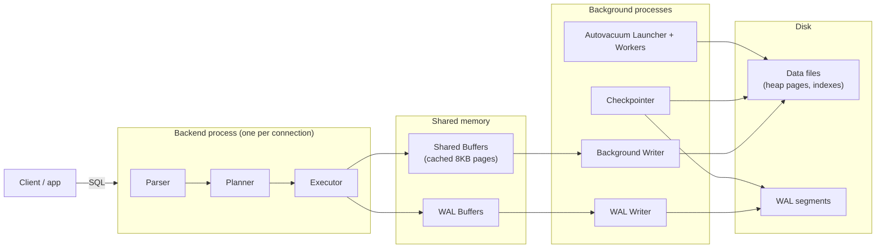
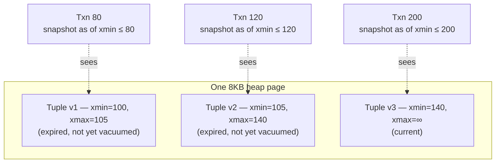
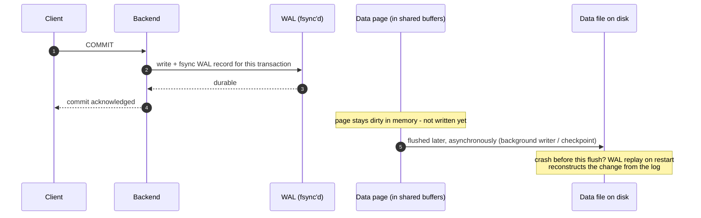

# postgres

A toy bank ledger built to rehearse PostgreSQL-internals interview questions (the kind Wise/Revolut-style interviews
ask), one of the modules described in the [root README](../README.md) alongside
[concurrency](../concurrency/README.md) and [kafka](../kafka/README.md). Same idea: one running story, written the way
you'd actually explain it out loud — the code is the easy part, being able to say *why* each line is there is the
interview.

Every concept here (MVCC, row locks, advisory locks, vacuum, WAL) only means something against a **real Postgres**, so —
like the kafka module — this project has no unit-test layer at all. Every test is a **Testcontainers integration test**
against a real `postgres:18-alpine` instance, and several go further and read Postgres's own internal counters
(`pg_stat_user_tables`, `ctid`) directly, rather than just trusting that a fix "should" work.

---

## PostgreSQL in one picture

**How a write becomes durable.** A backend process writes to shared memory and to the WAL; background processes are what
eventually get everything onto disk.



**Reading it out loud:** a query is parsed, planned, and executed by a backend process dedicated to that connection. The
executor changes rows in **shared buffers** (Postgres's own page cache, not the OS's) and writes the change to the **WAL
buffer** first — "write-ahead" means the log record is durable before the data page is. The **WAL writer** and
**checkpointer** flush things to disk on their own schedule; **autovacuum** runs separately, cleaning up old row
versions (more on that in phase4). None of the background processes are on the critical path of a single query — that's
what lets Postgres acknowledge a commit fast without waiting for every dirty page to hit disk.

**One page, several tuple versions.** MVCC means "delete" and "update" never remove anything immediately — they just
mark a tuple no longer visible to new transactions and leave the old bytes in place for anyone whose snapshot still
needs them.



**Reading it out loud:** every row version carries the id of the transaction that created it (`xmin`) and, once
superseded, the one that expired it (`xmax`). A transaction's snapshot decides which version is visible to it — "reads
never block writes and writes never block reads" because a reader just picks the version whose `xmin`/`xmax` bracket its
own snapshot, instead of waiting for a lock. `v1` and `v2` are **dead tuples**: nobody can see them anymore once every
older transaction has finished, but the space isn't reclaimed until `VACUUM` runs (phase4).

**Commit doesn't wait for the data page.**



**Reading it out loud:** the client gets its "commit succeeded" the moment the WAL record is fsynced — not when the
actual data page hits disk. That's safe because the WAL record alone is enough to redo the change on restart if the
server crashes before the page is flushed; the "Startup Process" replays WAL from the last checkpoint forward. This is
also why `checkpoint_completion_target` matters in phase4: checkpoints eventually have to flush every dirty page, and
spreading that out over time avoids an I/O spike that would otherwise latency-spike every other query running at that
moment — including a card authorization.

---

## Quickstart

```powershell
cd Learning-Bank
.\mvnw.cmd -pl postgres verify      # starts its own Postgres via Testcontainers — needs Docker
```

To run the app standalone (outside of tests), start the local Postgres in `docker/docker-compose.yml` — it matches the
datasource already configured in `application.yml`:

```powershell
docker compose -f docker/docker-compose.yml up -d
.\mvnw.cmd -pl postgres spring-boot:run   # runs on :8083
```

```powershell
curl -X POST localhost:8083/api/accounts -H "Content-Type: application/json" -d "{\"owner\":\"alice\"}"
curl -X POST localhost:8083/api/accounts -H "Content-Type: application/json" -d "{\"owner\":\"bob\"}"
curl -X POST localhost:8083/api/transfers -H "Content-Type: application/json" -d "{\"idempotencyKey\":\"tx-1\",\"fromAccountId\":1,\"toAccountId\":2,\"amountMinor\":500}"
curl localhost:8083/api/accounts/1
curl "localhost:8083/api/accounts/1/postings?page=0&size=10"
curl "localhost:8083/api/accounts/1/postings/seek?size=10"   # then pass back nextCreatedAt / nextId
curl -X POST localhost:8083/api/refunds/42
curl -X POST localhost:8083/api/jobs -H "Content-Type: application/json" -d "{\"payload\":\"job-1\"}"
curl -X POST localhost:8083/api/jobs/claim
```

---

## Phase 1 — Transaction isolation & MVCC (`phase1_isolation/`)

**The scenario:** two accounts share one combined overdraft limit — a withdrawal from either is only allowed if
`balance(A) + balance(B)` can cover it. This is the textbook **write-skew** anomaly: two transactions each read a
predicate over data the other one is about to change, both see "yes, there's room," and both commit. Neither ever wrote
a row the other one read, so a row lock wouldn't have helped even if you'd thought to take one.

**`JointOverdraftTransactionalOps.withdrawReadCommitted`** reproduces it on purpose: read the combined balance, check
it, insert a debit — all under the default `READ COMMITTED`. `Phase1IsolationIT` forces two withdrawals (one against
each account) to both finish their read before either writes, and the combined balance ends up **negative** — each
transaction's own view of the world was consistent, the anomaly only exists across the two of them.

**`withdrawSerializableOnce`** is the identical method under `SERIALIZABLE`. Postgres's serializable implementation
(SSI — Serializable Snapshot Isolation) tracks the actual read/write dependency between the two transactions and aborts
one of them with SQLSTATE `40001` ("could not serialize access due to read/write dependencies").
**`JointOverdraftService`** catches that — by reading the SQLState off the exception's cause chain, not by trusting a
specific Spring/Hibernate exception subtype — and retries with a brand-new transaction. The retry isn't a workaround
for a flaky database; it's the other half of what SERIALIZABLE actually promises: not "this can never go wrong," but
"if it would have gone wrong, you'll be told and can retry."

**Interview tip:** know the difference between **read skew** (a single transaction sees an inconsistent snapshot across
two reads because it read at two different times), **lost update** (two transactions both read-modify-write the same row
and one overwrites the other — which a plain `UPDATE` mostly avoids because it re-reads the current row version before
applying), and **write skew** (two transactions each act correctly on their own snapshot, but their combined effect
violates an invariant neither one alone broke). Only `SERIALIZABLE` catches all three; `READ COMMITTED` catches none of
them and `REPEATABLE READ` still misses write skew.

---

## Phase 2 — The append-only ledger & storage internals (`phase2_ledger/`)

**The rule:** there is no `balance` column anywhere in this schema. A balance is always `SUM(postings.amount_minor)` for
an account (`LedgerService.balanceOf`) — a value **derived** from history, never a fact stored and mutated.
`TransferTransactionalOps` never issues `UPDATE ... SET balance = balance + ?`; a transfer always inserts exactly two
rows, a debit and a credit, in one transaction — double-entry bookkeeping, enforced by construction rather than a
database CHECK constraint (phase 6 shows how you *would* enforce it in the database, and why a plain `CHECK` can't).

**Idempotency is a UNIQUE constraint, not an if-check.** `transfers.idempotency_key` is `UNIQUE` at the schema level.
`TransferTransactionalOps.apply` always tries the insert; if a concurrent request already committed the same key,
Postgres rejects the second insert and `TransferService` catches `DataIntegrityViolationException`, looks up what
already committed, and returns that instead of erroring. `Phase2LedgerIT.IdempotencyTests` fires the exact same transfer
request twice, concurrently, and proves it posts exactly once — the constraint is the guarantee, the code around it is
bookkeeping.

**Storage internals, proved rather than asserted:**

- **`Phase2LedgerIT.HotUpdateTests`** repeatedly updates `postings.note` — a column with no index on it — and reads
  `pg_stat_user_tables.n_tup_hot_upd` before and after. It goes up: Postgres wrote the new tuple version to the *same
  page* without touching any index, because no indexed column changed and there was room. **HOT (Heap-Only Tuple)
  updates** are why an append-heavy ledger with a few mutable side columns doesn't pay full index-maintenance cost on
  every write.
- **`Phase2LedgerIT.TupleVersionTests`** reads a row's `ctid` (its physical page + offset), updates it, and reads
  `ctid` again — it's different. Concrete proof that `UPDATE` is "insert a new tuple version, mark the old one
  expired," never an in-place byte rewrite. The old tuple isn't gone; it's a dead tuple now, waiting for `VACUUM`
  (phase4).

**Interview tip:** "why not just `UPDATE balance`?" — because a mutable balance can only ever tell you the current
number, never how it got there, and any bug that touches it silently corrupts the one number everyone trusts. An
append-only ledger makes the balance a projection you can always recompute, replay, or audit against the postings that
produced it.

---

## Phase 3 — WAL, coordination & reliability (`phase3_coordination/`)

**Advisory locks.** `RefundService.tryRefund` calls `pg_try_advisory_xact_lock(orderId)` — a lock keyed on an arbitrary
number, backed by no table or row. `_try_` means it never blocks: if another session already holds the same key, this
returns `false` immediately. `_xact_` means it releases itself automatically at commit/rollback — nothing to remember to
unlock. `Phase3CoordinationIT.AdvisoryLockTests` runs two concurrent refund attempts for the same order id and proves
the second one is rejected **without waiting** — the whole point of reaching for an advisory lock instead of a row lock
(which would instead make the second caller queue).

**The transactional outbox.** `TransferTransactionalOps.apply` writes an `outbox` row in the **same transaction** as the
ledger postings it describes. `Phase3CoordinationIT.OutboxTests` proves this is a real atomicity guarantee, not just an
ordering convention: in a duplicate-idempotency-key race, the losing transaction gets as far as inserting its outbox row
*before* its `transfers` insert hits the unique-key violation — and that outbox row is rolled back along with everything
else in the same transaction. Without this pattern, you get the classic **dual-write problem**: the ledger write and the
event publish are two different systems with no shared transaction, and a crash between them either loses the event or
fabricates one for a transfer that never happened. `OutboxRelay` is the other half — a poller that reads unpublished
rows and hands them to a real downstream (a message broker, in production; logged here — see the kafka module for the
broker side of this pattern).

**`SELECT ... FOR UPDATE SKIP LOCKED`.** `JobRunner.claimNext()` is a scalable job-queue primitive: `FOR UPDATE` takes a
row lock on a candidate job, and `SKIP LOCKED` means a worker that would otherwise block waiting for a row another
worker already claimed just skips it and looks at the next one instead. Without `SKIP LOCKED`, every worker but one
queues up behind the same lock — the opposite of what a worker pool is for. `Phase3CoordinationIT.SkipLockedTests` runs
8 concurrent workers against 30 seeded jobs and proves every job is claimed by exactly one worker, with no worker ever
blocking on a row someone else already has.

**Interview tip:** WAL durability is what makes crash recovery deterministic — on restart, the "Startup Process" replays
WAL from the last checkpoint forward, reapplying anything that was fsynced but might not have reached a data page yet
(see the sequence diagram above). A single Testcontainers instance can't demonstrate an actual crash-and-replay, but
being able to name that this is what durability *means* — not "the data is definitely on disk," but "the log needed to
reconstruct it definitely is" — is worth more in an interview than watching it happen.

---

## Phase 4 — Vacuum, bloat & JPA pitfalls (`phase4_performance/`)

**Bloat, made visible.** `Phase4PerformanceIT.BloatTests` updates one row 100 times and watches
`pg_stat_user_tables.n_dead_tup` climb — each update leaves the previous tuple version behind as dead weight (phase2's
`Phase2LedgerIT.TupleVersionTests` showed the same thing at the `ctid` level). Running `VACUUM` brings the count back
down. **`Phase4PerformanceIT.LongTxnBloatTests`** is the pitfall version: it opens a transaction on one connection and
leaves it running, updates the same row from a second connection, and runs `VACUUM` while the first transaction is still
open — the dead tuples **aren't reclaimed**, because `VACUUM` can never remove a tuple version that a still-open
transaction's snapshot might still need to see. Only after that transaction commits does a second `VACUUM` actually
reclaim the space. This is the real-world failure mode behind "why is this table's disk usage growing forever even
though the row count is flat" — and it's almost always one connection somewhere holding a transaction open far longer
than anyone intended (an ORM session leaked across a request, a forgotten `BEGIN` in a psql tab).

**The N+1 query, counted, not guessed.** `AccountHistoryService.loadNPlusOne` loads a list of accounts (one query) and
then touches each one's lazy `postings` collection (one query per account - N+1 total). `loadFetchJoined` does the same
job with a `JOIN FETCH` query — one query, full stop. `Phase4PerformanceIT.NPlusOneTests` doesn't just time the two
paths; it reads Hibernate's own `Statistics.getPrepareStatementCount()` and asserts the exact number of SQL statements
each path issues, so the "fix" is verified rather than assumed. This is the sharp edge of Spring Data JPA's default LAZY
association: perfectly fine for a single account, silently quadratic the moment something loops over a list of them —
e.g., generating an account statement across many accounts.

**Pagination.** `GET /api/accounts/{id}/postings` takes a `Pageable` straight off the query string (`?page=0&size=20`) —
`Phase4PerformanceIT.PaginationTests` seeds 25 rows and asserts the endpoint actually returns a 10-row page with the
right totals, not just that it accepts the parameters. A transaction-history endpoint that loads everything and
paginates in memory works fine in a demo and falls over the first time a real customer has ten years of history.

**Interview tip:** `checkpoint_completion_target` controls how a checkpoint spreads its dirty-page flush over time
instead of doing it all at once — without spreading it out, a checkpoint can cause a burst of disk I/O that
latency-spikes every other query in flight, which in a payment system means a card authorization timing out for a reason
that has nothing to do with the authorization logic itself.

---

## Phase 5 — Indexes & query plans (`phase5_indexing/`)

**Assert on the plan, never on the clock.** Every test here runs `EXPLAIN (ANALYZE, BUFFERS, FORMAT JSON)` and asserts
on the node types the planner chose — the same discipline as `Phase4PerformanceIT.NPlusOneTests` counting Hibernate
statements instead of timing them. A timing assertion tells you the machine was busy; a plan assertion tells you what
the database decided and why. The JSON is parsed rather than string-matched, because `"Index Only Scan"` contains
`"Index Scan"` and grep can't tell a top-level `Seq Scan` from one buried in a subplan.

**A sequential scan is sometimes correct — `Phase5IndexingIT.IndexPlanTests`.** The fixture seeds 100k postings split
lopsidedly across two accounts. The account holding a couple of hundred rows gets an **Index Scan**; the account holding
essentially all of them correctly gets a **Seq Scan**, because reading 99% of a table through an index means a random
heap jump per row and costs more than just reading the table. Same table, same index, opposite decisions, both right. If
your answer to *"why isn't it using my index?"* is always "force it", this is the case that should change your mind. A
third test drops the index inside a transaction that is **always rolled back** — DDL is transactional in Postgres,
unlike MySQL — and watches the same query fall back to a Seq Scan touching far more of the disk. Deliberately not `SET
enable_indexscan = off`, which would only prove the planner obeys a knob.

**Column order: equality first, then the sort — `Phase5IndexingIT.CompositeOrderTests`.** `(account_id, created_at DESC,
id DESC)` serves `WHERE account_id = ? ORDER BY created_at DESC` with no sort step at all; `(created_at, account_id)`
doesn't. **The assertion is the absence of a sort node, not index-vs-seq-scan, and on Postgres 18 that distinction
matters.** The textbook rule is "a composite index is unusable without a predicate on its leading column" — PG18's
B-tree **skip scan** softens exactly that, so the wrong index may well be *usable* here. What skip scan cannot do is
return rows already ordered by a trailing column. So "the right index removes the sort" holds on 16 and 18 alike, and
it's the sharper claim: an index earns its keep by satisfying the `ORDER BY`, not by being touched.

Worth knowing what actually comes back for the wrong index: `[Limit, Incremental Sort, Index Scan]`. **Incremental
Sort** (PG13+) appears when the input is already ordered by a *prefix* of the required keys, so Postgres sorts only
within each group of equal values and can start returning rows before consuming the whole input. Cheaper than a full
`Sort` — and still a sort. An exact-equality check for `"Sort"` passes right over it.

**Partial indexes — `Phase5IndexingIT.PartialIndexTests`.** `idx_outbox_unpublished` covers `(id) WHERE NOT published`,
which is the only query the relay ever runs. An outbox grows forever but its interesting set is always the small
unrelayed tail, so the index stays proportional to the *backlog* rather than to history. The catch: the planner can only
use it when it can prove the query's predicate implies the index's, so a query that doesn't mention `published` silently
gets a sequential scan — which the second test asserts, because knowing when it *won't* apply is the half people miss.

**Keyset pagination — `Phase5IndexingIT.KeysetPaginationTests`.** `OFFSET 50000` reads fifty thousand rows through the
index, discards every one, and returns the next twenty: O(offset + size), so the endpoint gets steadily worse in a way
that never shows up in testing against ten rows. Seeking with a row comparison — `(created_at, id) < (:ts, :id)` — is
O(page size) at any depth. Written as a row constructor rather than `created_at < ? OR (created_at = ? AND id < ?)`,
which is logically identical but makes the planner choose between two branches instead of seeking once. `id` is in the
key so the order is **total**: with `created_at` alone, rows sharing a timestamp have no defined order between pages, so
one can be shown twice and another skipped. The two are compared on **buffers read**, and the honest cost is stated — no
page numbers and no total, because there is no `COUNT`, which is why `/postings` and `/postings/seek` both exist.

**Interview tip:** the test that compares the two pagination styles originally failed, and the reason is worth more than
the test. Reading the cursor with raw JDBC (`getTimestamp().toInstant()`) and feeding that `Instant` back through a
Hibernate-bound parameter compares two different interpretations of a `TIMESTAMP WITHOUT TIME ZONE` — the driver
resolves against the JVM default zone, Hibernate against its own — and the seek landed hours away from the offset page.
Which is the argument for `TIMESTAMPTZ` over `TIMESTAMP` for anything a cursor is built from.

---

## Phase 6 — Operations: snapshots, deferred constraints, deadlocks, online DDL (`phase6_operations/`)

**"Balance is `SUM(postings)` — so how do you read one in a millisecond at ten million rows?"** This is the first thing
a payments interviewer asks about an append-only ledger, and the design isn't wrong, it's *unbounded*. The answer is a
checkpoint, not a mutable balance column:

```
balance = snapshot.balance_minor
        + SUM(postings WHERE account_id = ? AND id > snapshot.as_of_posting_id)
```

The read becomes O(postings since the last snapshot). **The immutable journal stays the source of truth** — the snapshot
is a cache that can always be recomputed from it and audited against it, so a bad snapshot is a performance bug rather
than a correctness one. `Phase6OperationsIT.SnapshotTests` never asserts a number in isolation; every assertion compares
against `LedgerService.balanceOf`, the full sum it is meant to accelerate, and measures the saving in **buffers read**
against the 100k-row fixture. The alternative worth naming: maintain a cached balance in the same transaction as each
posting, with a nightly job asserting `cached == SUM(postings)`. Faster, riskier — every write path must remember, and a
missed one is silent corruption. **Snapshots fail safe; cached balances fail wrong.**

The subtle bit is in `takeSnapshot`: the sum is bounded by the recorded high-water mark, not taken over everything.
Under READ COMMITTED each statement gets a fresh snapshot, so a posting can commit between reading the mark and summing
— and if it landed inside the balance while sitting *above* the recorded id, the delta would add it again and the cached
balance would drift upward permanently. Bounding the sum makes snapshot and delta partition the postings exactly.

**Enforcing double-entry in the database — `Phase6OperationsIT.DeferredBalanceConstraintTests`.** The README used to say
debits=credits is enforced "by construction rather than a database CHECK", which invites *"so how would you do it in the
database?"* A plain `CHECK` can't: it sees one row, and the invariant spans every row sharing a `transfer_id`. A
**deferred constraint trigger** can. `DEFERRABLE INITIALLY DEFERRED` is the whole point — halfway through a transfer the
ledger is legitimately unbalanced, so a trigger firing at statement time would reject every transfer ever made. The test
drives raw JDBC with `autoCommit = false` so the unusual shape is visible: **the INSERT succeeds and the COMMIT throws**
`23514`. Through `@Transactional` that would surface as a `TransactionSystemException` from inside a proxy and the
lesson would be lost.

Two implementation notes worth stealing. The trigger's first statement is `IF NEW.transfer_id IS NULL THEN RETURN NULL`
— phase 1 posts standalone debits with a null `transfer_id` and its whole write-skew demo depends on it, so without that
guard `Phase1IsolationIT` breaks immediately. And the function body is a **single-quoted literal, not `$$`
dollar-quoted**: Spring's `ScriptUtils` splits `schema.sql` on semicolons and doesn't understand dollar quoting, so a
`$$` body gets chopped at the first internal `;`.

**Postgres breaks its own deadlocks — `Phase6OperationsIT.PgDeadlockTests`.** The concurrency module deadlocks two Java
threads on two `ReentrantLock`s and proves it with `ThreadMXBean`. This is the same circular wait one layer down, on two
rows — and the difference is what happens next. **A JVM deadlock hangs forever; Postgres kills a victim.** Any backend
waiting longer than `deadlock_timeout` (1s default) runs a wait-graph check and aborts one side with SQLSTATE `40P01`;
the survivor commits. So "handle deadlocks" means something different here: you still prevent them by lock ordering
(`SELECT ... FOR UPDATE` in ascending id order is the database's `LockOrderedTransferService`), but you must also
**retry**, because the engine will occasionally shoot one of your transactions on purpose. Same retry loop `40001` needs
— which is why both codes belong in the same catch. The test asserts *exactly one* side failed rather than assuming
which; Postgres picks.

**Online DDL — `Phase6OperationsIT.ConcurrentIndexTests`.** Plain `CREATE INDEX` takes a `SHARE` lock: reads continue,
**every write blocks for the whole build**. That's the difference between "the migration was slow" and "the migration
took the site down". `CONCURRENTLY` takes only `SHARE UPDATE EXCLUSIVE` and lets writes through, at the cost of two
passes over the table — and it **cannot run inside a transaction block**, which the second test asserts by catching
SQLSTATE `25001`. That's the first thing that bites anyone dropping it into a `@Transactional` migration method. The
other trap: a `CONCURRENTLY` build that fails partway leaves an **invalid** index, still maintained on every write but
never used for reads, and the migration looks finished. `pg_index.indisvalid` is where you find out.

**Interview tip:** the rest of the zero-downtime toolkit, in one breath — `ADD CONSTRAINT ... NOT VALID` then `VALIDATE
CONSTRAINT`, so the full-table check happens without a strong lock; expand/contract dual-writes for column renames; and
always `SET lock_timeout` before DDL, so a migration that can't get its lock fails fast instead of queueing — with every
query arriving behind it queueing too, which is how a lock wait becomes an outage.

---

## Project layout

```
src/main/java/com/postgresbank/
  common/               Account, Posting, Transfer, Outbox entities + repositories, LedgerService, AccountController
  phase1_isolation/     JointOverdraftTransactionalOps, JointOverdraftService, OverdraftController
  phase2_ledger/        TransferTransactionalOps, TransferService, TransferController
  phase3_coordination/  RefundService, OutboxRelay(+TransactionalOps), PaymentJob, JobRunner, CoordinationController
  phase4_performance/   AccountHistoryService, PostingHistoryController (offset + seek pagination)
  phase6_operations/    BalanceSnapshot(+Repository), BalanceSnapshotService(+TransactionalOps)
src/main/resources/
  application.yml       datasource, hibernate.generate_statistics (needed by Phase4PerformanceIT.NPlusOneTests)
  schema.sql            tables, indexes, the amount CHECK, snapshots, and the deferred balance trigger
src/test/java/com/postgresbank/
  TestContainerConfig.java          singleton Postgres container shared by every IT
  testsupport/TestSupport.java      shared account-creation + pg_stat-counter helpers
  testsupport/ExplainSupport.java   EXPLAIN (ANALYZE, BUFFERS, FORMAT JSON) parsed into an assertable plan
  testsupport/IndexFixture.java     100k-posting fixture, seeded once per container
  phase1_isolation/Phase1IsolationIT.java       write skew under READ COMMITTED vs SERIALIZABLE
  phase2_ledger/Phase2LedgerIT.java             @Nested: TupleVersion, HotUpdate, Idempotency
  phase3_coordination/Phase3CoordinationIT.java @Nested: AdvisoryLock, Outbox, SkipLocked
  phase4_performance/Phase4PerformanceIT.java   @Nested: Bloat, LongTxnBloat, NPlusOne, Pagination
  phase5_indexing/Phase5IndexingIT.java         @Nested: IndexPlan, CompositeOrder, PartialIndex, KeysetPagination
  phase6_operations/Phase6OperationsIT.java     @Nested: Snapshot, DeferredBalanceConstraint, PgDeadlock, ConcurrentIndex
```

**There is no `phase5_indexing/` under `src/main`, and that is not an omission.** Phase 5 is about what the *planner*
does, so everything it teaches lives in `schema.sql` (the indexes) and in the IT that reads `EXPLAIN` output back. There
is no application code to write — which is itself the point: an index is a schema decision, not a Java one.

One IT per phase, rather than one per topic: these tests are read far more often than they are run, and a phase's
blocks frequently differ by a single variable (`Phase4PerformanceIT`'s two bloat blocks are the same experiment with a
transaction left open). Keeping a phase in one file is what lets you see that. The `@Nested` blocks keep each topic
grouped in the IDE test tree, and a single one can be targeted with ``-Dit.test='Phase5IndexingIT$PartialIndexTests'``.
Fixtures every block shares are injected once on the outer class; a block declares only the beans that are its own.

## Commands

```powershell
.\mvnw.cmd -pl postgres verify                              # full Testcontainers IT suite
.\mvnw.cmd -pl postgres verify -Dit.test=Phase1IsolationIT -Dtest=skip   # single IT
.\mvnw.cmd -pl postgres spring-boot:run                     # run standalone (needs docker/docker-compose.yml up)
```

---

## Questions this module answers

| Question                                                      | Where                                          |
|---------------------------------------------------------------|------------------------------------------------|
| Two withdrawals against a shared limit both succeed. Why?     | phase 1 — write skew, `Phase1IsolationIT`            |
| What does SERIALIZABLE actually cost you?                     | phase 1 — SSI, `40001`, retry loops            |
| Where do you store a balance?                                 | phase 2 — nowhere; it's `SUM(postings)`        |
| How is idempotency actually enforced?                         | phase 2 — a UNIQUE constraint, `Phase2LedgerIT.IdempotencyTests` |
| Does an UPDATE rewrite the row in place?                      | phase 2 — `ctid`, `Phase2LedgerIT.TupleVersionTests`             |
| What is a HOT update and when do you lose it?                 | phase 2 — `Phase2LedgerIT.HotUpdateTests`                        |
| Build a job queue that several workers can share.             | phase 3 — `SKIP LOCKED`, `Phase3CoordinationIT.SkipLockedTests`        |
| Advisory locks — session or transaction scoped, and why care? | phase 3 — `RefundService`                      |
| The table grows but the row count is flat.                    | phase 4 — bloat, `Phase4PerformanceIT.LongTxnBloatTests`              |
| Why didn't VACUUM reclaim anything?                           | phase 4 — the vacuum horizon                   |
| Find the N+1 without guessing.                                | phase 4 — Hibernate `Statistics`               |
| Why isn't Postgres using my index?                            | phase 5 — `Phase5IndexingIT.IndexPlanTests`                        |
| What order should a composite index's columns be in?          | phase 5 — `Phase5IndexingIT.CompositeOrderTests`                   |
| Page 5000 of this endpoint is slow.                           | phase 5 — keyset pagination                    |
| Read a balance in a millisecond at 10M postings.              | phase 6 — `Phase6OperationsIT.SnapshotTests`                         |
| Enforce debits = credits in the database.                     | phase 6 — deferred constraint trigger          |
| Two transactions deadlock in Postgres. Does it hang?          | phase 6 — `40P01`, `Phase6OperationsIT.PgDeadlockTests`              |
| Add an index to a hot table without downtime.                 | phase 6 — `Phase6OperationsIT.ConcurrentIndexTests`                  |
