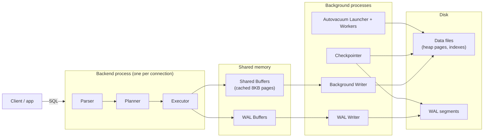
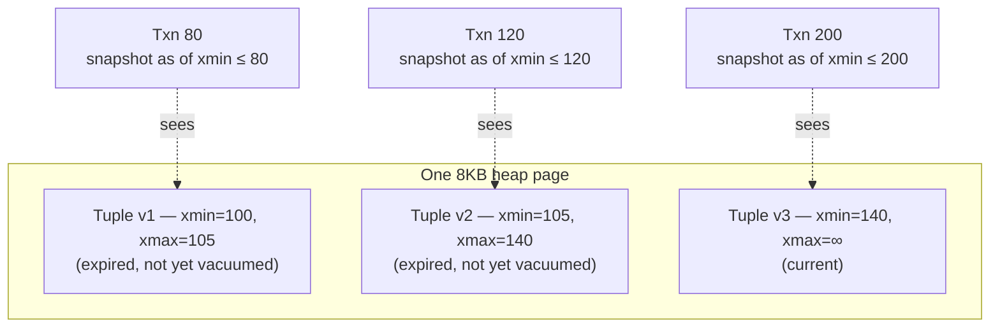
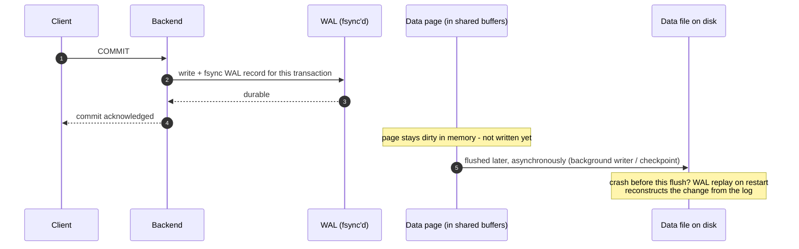

# postgres

A toy bank ledger built to rehearse PostgreSQL-internals interview questions
(the kind Wise/Revolut-style interviews ask), the third in a series with
[concurrency](../concurrency/README.md) (Java concurrency) and
[kafka](../kafka/README.md) (Kafka). Same idea: one running story, written
the way you'd actually explain it out loud - the code is the easy part,
being able to say *why* each line is there is the interview.

Every concept here (MVCC, row locks, advisory locks, vacuum, WAL) only means
something against a **real Postgres**, so - like the kafka module - this project
has no unit-test layer at all. Every test is a **Testcontainers integration
test** against a real `postgres:18` instance, and several go further and read
Postgres's own internal counters (`pg_stat_user_tables`, `ctid`) directly,
rather than just trusting that a fix "should" work.

---

## PostgreSQL in one picture

**How a write becomes durable.** A backend process writes to shared memory
and to the WAL; background processes are what eventually get everything onto
disk.



**Reading it out loud:** a query is parsed, planned, and executed by a
backend process dedicated to that connection. The executor changes rows in
**shared buffers** (Postgres's own page cache, not the OS's) and writes the
change to the **WAL buffer** first - "write-ahead" means the log record is
durable before the data page is. The **WAL writer** and **checkpointer**
flush things to disk on their own schedule; **autovacuum** runs separately,
cleaning up old row versions (more on that in phase4). None of the background
processes are on the critical path of a single query - that's what lets
Postgres acknowledge a commit fast without waiting for every dirty page to
hit disk.

**One page, several tuple versions.** MVCC means "delete" and "update" never
remove anything immediately - they just mark a tuple no longer visible to new
transactions and leave the old bytes in place for anyone whose snapshot still
needs them.



**Reading it out loud:** every row version carries the id of the transaction
that created it (`xmin`) and, once superseded, the one that expired it
(`xmax`). A transaction's snapshot decides which version is visible to it -
"reads never block writes and writes never block reads" because a reader
just picks the version whose `xmin`/`xmax` bracket its own snapshot, instead
of waiting for a lock. `v1` and `v2` are **dead tuples**: nobody can see them
anymore once every older transaction has finished, but the space isn't
reclaimed until `VACUUM` runs (phase4).

**Commit doesn't wait for the data page.**



**Reading it out loud:** the client gets its "commit succeeded" the moment
the WAL record is fsynced - not when the actual data page hits disk. That's
safe because the WAL record alone is enough to redo the change on restart if
the server crashes before the page is flushed; the "Startup Process" replays
WAL from the last checkpoint forward. This is also why `checkpoint_completion_target`
matters in phase4: checkpoints eventually have to flush every dirty page, and
spreading that out over time avoids an I/O spike that would otherwise
latency-spike every other query running at that moment - including a card
authorization.

---

## Quickstart

```powershell
cd Learning-Bank
.\mvnw.cmd -pl postgres verify      # starts its own Postgres via Testcontainers - needs Docker
```

To run the app standalone (outside of tests), start the local Postgres in
`docker/docker-compose.yml` - it matches the datasource already configured in
`application.yml`:

```powershell
docker compose -f docker/docker-compose.yml up -d
.\mvnw.cmd -pl postgres spring-boot:run   # runs on :8083
```

```powershell
curl -X POST localhost:8083/api/accounts -H "Content-Type: application/json" -d "{\"owner\":\"alice\"}"
curl -X POST localhost:8083/api/accounts -H "Content-Type: application/json" -d "{\"owner\":\"bob\"}"
curl -X POST localhost:8083/api/transfers -H "Content-Type: application/json" -d "{\"idempotencyKey\":\"tx-1\",\"fromAccountId\":1,\"toAccountId\":2,\"amountMinor\":500}"
curl localhost:8083/api/accounts/1
curl "localhost:8083/api/accounts/1/postings?page=0&size=10"
curl -X POST localhost:8083/api/refunds/42
curl -X POST localhost:8083/api/jobs -H "Content-Type: application/json" -d "{\"payload\":\"job-1\"}"
curl -X POST localhost:8083/api/jobs/claim
```

---

## Phase 1 — Transaction isolation & MVCC (`phase1_isolation/`)

**The scenario:** two accounts share one combined overdraft limit - a
withdrawal from either is only allowed if `balance(A) + balance(B)` can cover
it. This is the textbook **write-skew** anomaly: two transactions each read a
predicate over data the other one is about to change, both see "yes, there's
room," and both commit. Neither ever wrote a row the other one read, so a row
lock wouldn't have helped even if you'd thought to take one.

**`JointOverdraftTransactionalOps.withdrawReadCommitted`** reproduces it on
purpose: read the combined balance, check it, insert a debit - all under the
default `READ COMMITTED`. `WriteSkewIT` forces two withdrawals (one against
each account) to both finish their read before either writes, and the
combined balance ends up **negative** - each transaction's own view of the
world was consistent, the anomaly only exists across the two of them.

**`withdrawSerializableOnce`** is the identical method under
`SERIALIZABLE`. Postgres's serializable implementation (SSI - Serializable
Snapshot Isolation) tracks the actual read/write dependency between the two
transactions and aborts one of them with SQLSTATE `40001` ("could not
serialize access due to read/write dependencies"). **`JointOverdraftService`**
catches that - by reading the SQLState off the exception's cause chain, not
by trusting a specific Spring/Hibernate exception subtype - and retries with
a brand-new transaction. The retry isn't a workaround for a flaky database;
it's the other half of what SERIALIZABLE actually promises: not "this can
never go wrong," but "if it would have gone wrong, you'll be told and can
retry."

**Interview tip:** know the difference between **read skew** (a single
transaction sees an inconsistent snapshot across two reads because it read
at two different times), **lost update** (two transactions both read-modify-
write the same row and one overwrites the other - which a plain `UPDATE`
mostly avoids because it re-reads the current row version before applying),
and **write skew** (two transactions each act correctly on their own
snapshot, but their combined effect violates an invariant neither one alone
broke). Only `SERIALIZABLE` catches all three; `READ COMMITTED` catches
none of them and `REPEATABLE READ` still misses write skew.

---

## Phase 2 — The append-only ledger & storage internals (`phase2_ledger/`)

**The rule:** there is no `balance` column anywhere in this schema. A
balance is always `SUM(postings.amount_minor)` for an account
(`LedgerService.balanceOf`) - a value **derived** from history, never a fact
stored and mutated. `TransferTransactionalOps` never issues
`UPDATE ... SET balance = balance + ?`; a transfer always inserts exactly two
rows, a debit and a credit, in one transaction - double-entry bookkeeping,
enforced by construction rather than a database CHECK constraint.

**Idempotency is a UNIQUE constraint, not an if-check.** `transfers.idempotency_key`
is `UNIQUE` at the schema level. `TransferTransactionalOps.apply` always tries
the insert; if a concurrent request already committed the same key,
Postgres rejects the second insert and `TransferService` catches
`DataIntegrityViolationException`, looks up what already committed, and
returns that instead of erroring. `IdempotencyIT` fires the exact same
transfer request twice, concurrently, and proves it posts exactly once - the
constraint is the guarantee, the code around it is bookkeeping.

**Storage internals, proved rather than asserted:**
- **`HotUpdateIT`** repeatedly updates `postings.note` - a column with no
  index on it - and reads `pg_stat_user_tables.n_tup_hot_upd` before and
  after. It goes up: Postgres wrote the new tuple version to the *same page*
  without touching any index, because no indexed column changed and there
  was room. **HOT (Heap-Only Tuple) updates** are why an append-heavy ledger
  with a few mutable side columns doesn't pay full index-maintenance cost on
  every write.
- **`TupleVersionIT`** reads a row's `ctid` (its physical page + offset),
  updates it, and reads `ctid` again - it's different. Concrete proof that
  `UPDATE` is "insert a new tuple version, mark the old one expired," never
  an in-place byte rewrite. The old tuple isn't gone; it's a dead tuple now,
  waiting for `VACUUM` (phase4).

**Interview tip:** "why not just `UPDATE balance`?" - because a mutable
balance can only ever tell you the current number, never how it got there,
and any bug that touches it silently corrupts the one number everyone
trusts. An append-only ledger makes the balance a projection you can always
recompute, replay, or audit against the postings that produced it.

---

## Phase 3 — WAL, coordination & reliability (`phase3_coordination/`)

**Advisory locks.** `RefundService.tryRefund` calls
`pg_try_advisory_xact_lock(orderId)` - a lock keyed on an arbitrary number,
backed by no table or row. `_try_` means it never blocks: if another session
already holds the same key, this returns `false` immediately. `_xact_` means
it releases itself automatically at commit/rollback - nothing to remember to
unlock. `AdvisoryLockIT` runs two concurrent refund attempts for the same
order id and proves the second one is rejected **without waiting** - the
whole point of reaching for an advisory lock instead of a row lock (which
would instead make the second caller queue).

**The transactional outbox.** `TransferTransactionalOps.apply` writes an
`outbox` row in the **same transaction** as the ledger postings it
describes. `OutboxIT` proves this is a real atomicity guarantee, not just an
ordering convention: in a duplicate-idempotency-key race, the losing
transaction gets as far as inserting its outbox row *before* its `transfers`
insert hits the unique-key violation - and that outbox row is rolled back
along with everything else in the same transaction. Without this pattern,
you get the classic **dual-write problem**: the ledger write and the event
publish are two different systems with no shared transaction, and a crash
between them either loses the event or fabricates one for a transfer that
never happened. `OutboxRelay` is the other half - a poller that reads
unpublished rows and hands them to a real downstream (a message broker, in
production; logged here - see the kafka module for the broker side of this pattern).

**`SELECT ... FOR UPDATE SKIP LOCKED`.** `JobRunner.claimNext()` is a
scalable job-queue primitive: `FOR UPDATE` takes a row lock on a candidate
job, and `SKIP LOCKED` means a worker that would otherwise block waiting for
a row another worker already claimed just skips it and looks at the next
one instead. Without `SKIP LOCKED`, every worker but one queues up behind the
same lock - the opposite of what a worker pool is for. `SkipLockedIT` runs 8
concurrent workers against 30 seeded jobs and proves every job is claimed by
exactly one worker, with no worker ever blocking on a row someone else
already has.

**Interview tip:** WAL durability is what makes crash recovery deterministic
- on restart, the "Startup Process" replays WAL from the last checkpoint
forward, reapplying anything that was fsynced but might not have reached a
data page yet (see the sequence diagram above). A single Testcontainers
instance can't demonstrate an actual crash-and-replay, but being able to
name that this is what durability *means* - not "the data is definitely on
disk," but "the log needed to reconstruct it definitely is" - is worth more
in an interview than watching it happen.

---

## Phase 4 — Vacuum, bloat & JPA pitfalls (`phase4_performance/`)

**Bloat, made visible.** `BloatIT` updates one row 100 times and watches
`pg_stat_user_tables.n_dead_tup` climb - each update leaves the previous
tuple version behind as dead weight (phase2's `TupleVersionIT` showed the
same thing at the `ctid` level). Running `VACUUM` brings the count back
down. **`LongTxnBloatIT`** is the pitfall version: it opens a transaction on
one connection and leaves it running, updates the same row from a second
connection, and runs `VACUUM` while the first transaction is still open -
the dead tuples **aren't reclaimed**, because `VACUUM` can never remove a
tuple version that an still-open transaction's snapshot might still need to
see. Only after that transaction commits does a second `VACUUM` actually
reclaim the space. This is the real-world failure mode behind "why is this
table's disk usage growing forever even though the row count is flat" - and
it's almost always one connection somewhere holding a transaction open far
longer than anyone intended (an ORM session leaked across a request, a
forgotten `BEGIN` in a psql tab).

**The N+1 query, counted, not guessed.** `AccountHistoryService.loadNPlusOne`
loads a list of accounts (one query) and then touches each one's lazy
`postings` collection (one query per account - N+1 total).
`loadFetchJoined` does the same job with a `JOIN FETCH` query - one query,
full stop. `NPlusOneIT` doesn't just time the two paths; it reads Hibernate's
own `Statistics.getPrepareStatementCount()` and asserts the exact number of
SQL statements each path issues, so the "fix" is verified rather than
assumed. This is the sharp edge of Spring Data JPA's default LAZY
association: perfectly fine for a single account, silently quadratic the
moment something loops over a list of them - e.g., generating an account
statement across many accounts.

**Pagination.** `GET /api/accounts/{id}/postings` takes a `Pageable`
straight off the query string (`?page=0&size=20`) - `PaginationIT` seeds 25
rows and asserts the endpoint actually returns a 10-row page with the right
totals, not just that it accepts the parameters. A transaction-history
endpoint that loads everything and paginates in memory works fine in a demo
and falls over the first time a real customer has ten years of history.

**Interview tip:** `checkpoint_completion_target` controls how a checkpoint
spreads its dirty-page flush over time instead of doing it all at once -
without spreading it out, a checkpoint can cause a burst of disk I/O that
latency-spikes every other query in flight, which in a payment system means
a card authorization timing out for a reason that has nothing to do with the
authorization logic itself.

---

## Summary for the interview

1. **Ledger as source of truth** - immutable postings, not a mutable balance
   (phase2).
2. **Idempotency boundaries** - a unique constraint on the business
   reference, not an application-level check, is what actually prevents
   double-posting (phase2, proved in `IdempotencyIT`).
3. **Deterministic failure** - `SERIALIZABLE` doesn't prevent every anomaly
   from being possible, it guarantees you're told when one would have
   happened, so the retry is part of the correctness story, not a bug fix
   (phase1). Every failure here produces either a clean rejection or a
   retried success - never silent corruption.

---

## Project layout

```
src/main/java/com/postgresbank/
  common/               Account, Posting, Transfer, Outbox entities + repositories, LedgerService, AccountController
  phase1_isolation/     JointOverdraftTransactionalOps, JointOverdraftService, OverdraftController
  phase2_ledger/        TransferTransactionalOps, TransferService, TransferController
  phase3_coordination/  RefundService, OutboxRelay, PaymentJob, JobRunner, CoordinationController
  phase4_performance/   AccountHistoryService, PostingHistoryController
src/main/resources/
  application.yml       datasource, hibernate.generate_statistics (needed by NPlusOneIT)
  schema.sql            accounts / transfers / postings / outbox / payment_jobs
src/test/java/com/postgresbank/
  TestContainerConfig.java          singleton Postgres container shared by every IT
  testsupport/TestSupport.java      shared account-creation + pg_stat-counter helpers
  phase1_isolation/WriteSkewIT.java
  phase2_ledger/{HotUpdateIT,TupleVersionIT,IdempotencyIT}.java
  phase3_coordination/{AdvisoryLockIT,OutboxIT,SkipLockedIT}.java
  phase4_performance/{NPlusOneIT,PaginationIT,BloatIT,LongTxnBloatIT}.java
```

## Commands

```powershell
.\mvnw.cmd -pl postgres verify                              # full Testcontainers IT suite
.\mvnw.cmd -pl postgres verify -Dit.test=WriteSkewIT -Dtest=skip   # single IT
.\mvnw.cmd -pl postgres spring-boot:run                     # run standalone (needs docker/docker-compose.yml up)
```

Docker Engine 29+ needs `api.version=1.44` in
`src/test/resources/docker-java.properties` (already there) or
Testcontainers gets misleading empty 400s from the daemon.
